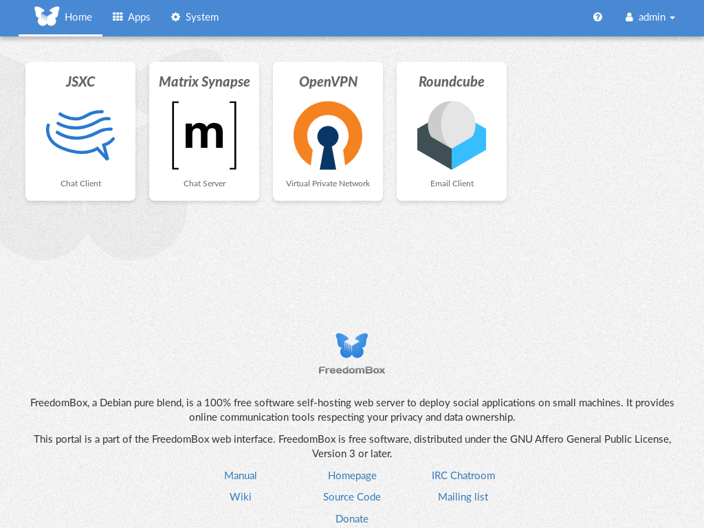
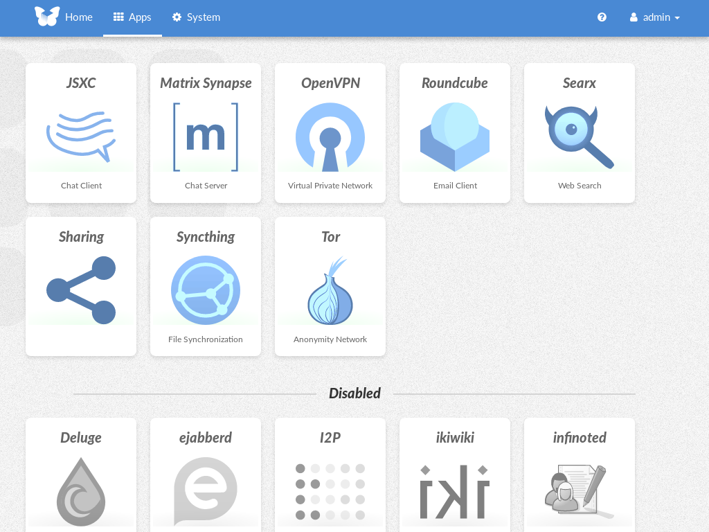
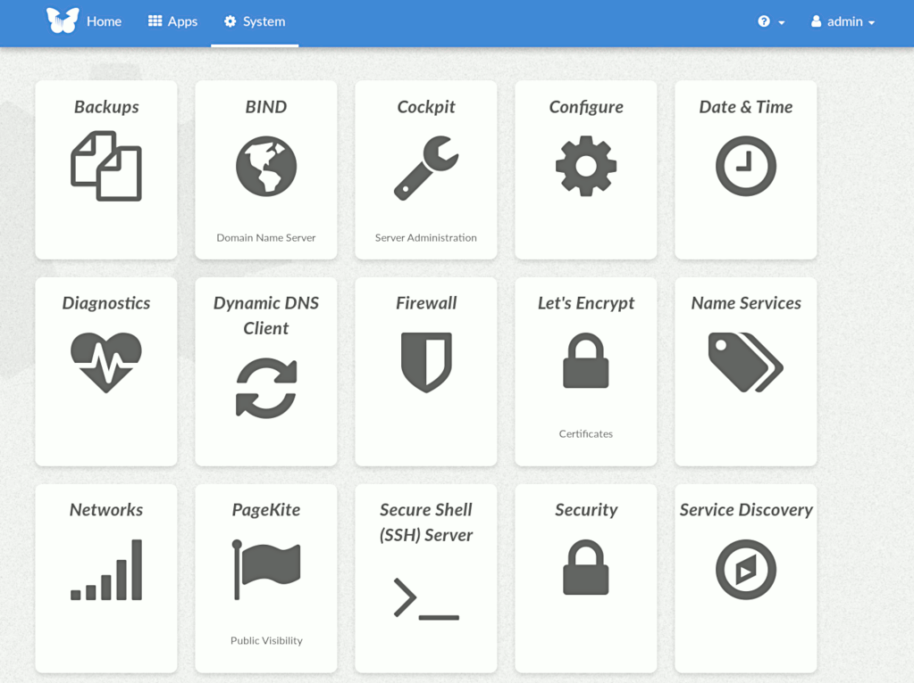
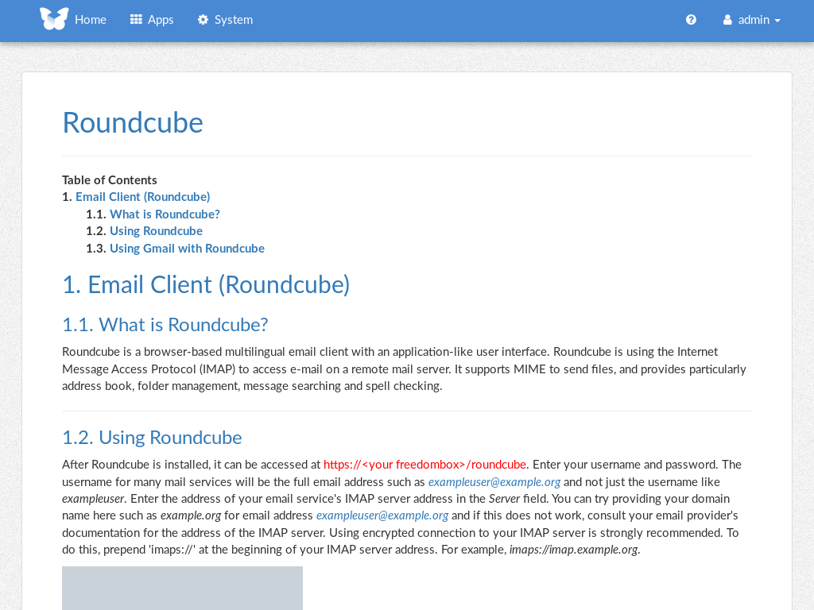
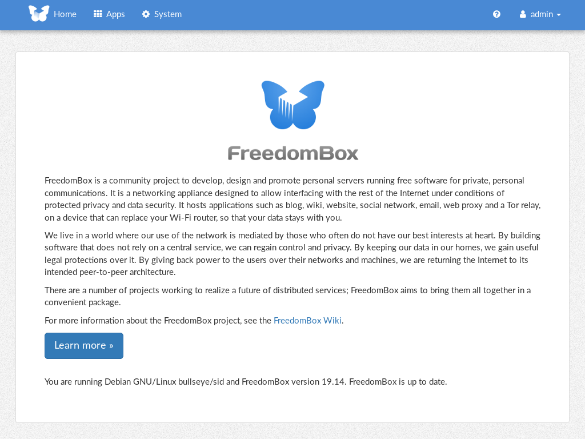

[](https://salsa.debian.org/freedombox-team/freedombox/commits/main)
[](https://hosted.weblate.org/engage/freedombox/?utm_source=widget)
[](https://packages.debian.org/unstable/freedombox)
[](https://packages.debian.org/testing/freedombox)
[](https://packages.debian.org/stable/freedombox)

# FreedomBox Service (Plinth)

The core functionality and web front-end of
[FreedomBox](https://freedombox.org/).

 

 

 

# Description

FreedomBox is a community project to develop, design and promote
personal servers running free software for private, personal
communications.  It is a networking appliance designed to allow
interfacing with the rest of the Internet under conditions of
protected privacy and data security.  It hosts applications such as
blog, wiki, website, social network, email, web proxy and a Tor relay,
on a device that can replace your Wi-Fi router, so that your data
stays with you.

This module, called FreedomBox Service and also know as Plinth, is the core
functionality and web interface to the functions of the FreedomBox. It is
extensible and provides various applications of FreedomBox as modules. Each
module or application provides simplified user interface to control the
underlying functionality. As FreedomBox can act as a wireless router, it is
possible to configure networking. It also allows configuration of basic system
parameters such as time zone, hostname and automatic upgrades.

You can find more information about FreedomBox Service (Plinth) on the
[Plinth Wiki](https://wiki.debian.org/FreedomBox/Plinth) page,
the [FreedomBox Wiki](https://wiki.debian.org/FreedomBox/) and the
[FreedomBox Manual](https://wiki.debian.org/FreedomBox/Manual).

# Getting Started

To have a running FreedomBox, first install Debian (Buster or higher) on a clean
machine. Then run:

```
$ sudo apt install freedombox
```

Full instructions are available on FreedomBox
[Manual](https://wiki.debian.org/FreedomBox/Manual/)'s
[QuickStart](https://wiki.debian.org/FreedomBox/Manual/QuickStart) page.

For instructions on running the service on a local machine from source code, see
INSTALL.md. For instructions on setting up for development purposes, see
HACKING.md.

# Contributing

See the [HACKING.md](https://salsa.debian.org/freedombox-team/freedombox/blob/main/HACKING.md) file for contributing to FreedomBox Service (Plinth).

# Localization

[](https://hosted.weblate.org/engage/freedombox/)

# License

[](https://www.gnu.org/licenses/agpl-3.0.html)

FreedomBox is distributed under the GNU Affero General Public License, Version 3
or later. A copy of [AGPLv3](http://www.gnu.org/licenses/agpl.html) is available
from the Free Software Foundation.
